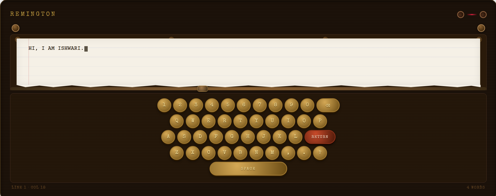

# 🖊️ Remington — Living Typewriter

A vintage typewriter experience built with vanilla HTML, CSS, and JavaScript. Type on real round keys, hear mechanical clicks, watch the carriage move, and feel the bell ding at the end of every line.



---

## ✨ Features

- 🎹 **Clickable round keys** — on-screen + full physical keyboard support
- 🔊 **Procedural audio** — mechanical clicks, heavy space bar thud, and a bell ding on return (Web Audio API, no files needed)
- 📜 **Living paper** — lined paper with red margin rule, auto-scrolls as you type
- ⚙️ **Animated ribbon spools** — spin on every keypress
- 🎯 **Carriage handle** — slides in real-time based on cursor column position
- 📱 **Touch support** — works on mobile too
- 🗒️ **Status bar** — live line, column, and word count

---

## 📁 Project Structure

```
typewriter/
├── index.html   # Markup & layout
├── style.css    # All visual styling
├── script.js    # Audio engine, typing logic, keyboard bindings
├── assets/
│   └── preview.png   # Screenshot for README
└── README.md
```

---

## 🚀 Deploy on Vercel

### Option A — Vercel CLI (fastest)

```bash
# 1. Install Vercel CLI globally
npm install -g vercel

# 2. Inside the project folder
cd typewriter

# 3. Deploy
vercel

# Follow the prompts — choose defaults for everything.
# Your live URL appears at the end, e.g. https://typewriter-abc123.vercel.app
```

### Option B — Vercel Dashboard (no CLI)

1. Push this repo to GitHub (see below)
2. Go to [vercel.com](https://vercel.com) → **Add New Project**
3. Import your GitHub repo
4. Leave all settings as default (Vercel auto-detects static sites)
5. Click **Deploy** — done in ~10 seconds

---

## 🐙 Push to GitHub

```bash
# Inside the project folder
git init
git add .
git commit -m "feat: living typewriter ✨"

# Create a new repo on github.com, then:
git remote add origin https://github.com/YOUR_USERNAME/typewriter.git
git branch -M main
git push -u origin main
```

---

## 🖼️ How to add a screenshot to this README

### Step 1 — Take a screenshot
Take a screenshot of the typewriter in your browser (full page or cropped to the machine).

### Step 2 — Add it to the repo
```bash
mkdir assets
# Copy your screenshot into the assets/ folder and name it preview.png
```

### Step 3 — Reference it in README.md
The image is already referenced at the top of this file:
```markdown

```
That's it — once `assets/preview.png` exists in your repo, GitHub renders it automatically.

### Step 4 — Commit & push
```bash
git add assets/preview.png
git commit -m "docs: add preview screenshot"
git push
```

> **Tip:** You can also drag-and-drop an image directly into GitHub's web editor when editing the README — it uploads it to the repo automatically and inserts the markdown for you.

---

## 🛠️ Local Development

No build tools needed. Just open `index.html` in any browser:

```bash
# With Python
python3 -m http.server 3000

# With Node
npx serve .

# Or just double-click index.html
```

---

## License

MIT — use it, remix it, make it yours.
